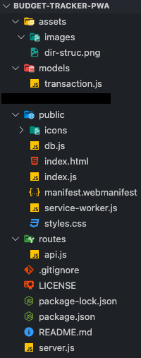

# Budget Tracker  

## Table of Contents
1. [Project Overview](#Project-Overview)
2. [Deployement](#Deployement)
3. [MVP](#MVP)
4. [Installation](#Installation)
5. [Usage](#Usage)
6. [Application Screenshot](#Application-Screenshot)
7. [License](#License)
8. [Credit](#Credit)
****

## Project Overview
Don't ever lose track of your financial activity - even when internet accessibility is null. This budget tracker will allow you to continue managing your financial flow even when offline as well as update your balances when reconnected!

### Project Status:

*COMPLETED*

#### Issues to debug:

*NONE TO NOTE*

****

## Deployment
This application is deployed through Heroku @ : https://pacific-lake-97425.herokuapp.com/

****

## MVP

### Project-build Aspects:

The following components are used to build the code for this project:

1. source code provided by T.E.S. (see [credits](#Credit))
2. Express.js
3. IndexedDB / MongoAtlas
4. Heroku for deployement

### Functionality:

The following lists all functions within this project:

* online functionality included with source code include entering deposits and expenses as well as a total budget tracker

* offline functionality through service-worker.js and indexedDB allows
    - entering deposits
    - entering expenses
    - followed by entries being added to the tracker when server is brought back online

### Process:

* npm packages installed
* manifest.webmanifest and db.js linked properly in index.html
* service-worker.js caches all necessary files to function offline

****

## Installation

1. Clone this repository onto local workspace
2. Open Terminal (MacOS) or Git Bash (Windows) and change location to where you want the cloned directory
3. Type `git clone` and paste copied respository
4. Directory should include the following:

5. Node.js is required for this application: download [HERE](https://nodejs.org/en/download/)

**IMPORTANT IF RUNNING APPLICATION ON LOCAL SERVER: `.env.EXAMPLE` needs to be renamed to `.env` and follow the instructions within the double //**

## Usage

Running with CLI:

`npm install` : install npm packages

`npm start`: to start application on local server *WITHOUT* nodemon

Within the browser > go to Chrome DevTools > Application tab
- here you will be able to see the Manifest, Service Workers, IndexedDB storage on the left hand column
- enter a few transactions for the budget tracker

continue > click on Service Workers and check "Offline" tick-box
- enter a new transaction and refresh page (application's tracker will not actually log new transaction upon refresh)
- refresh IndexedDB and navigate to nested pendingTransactions database to see the offline data being saved

continue > click on Service Workers and uncheck "Offline" tick-box
- refresh page and those offline records should be added to the application's tracker from IndexedDB

****

## Application Screenshot 

****

## License
This application is licensed under MIT - please see the provided LICENSE file included in this repository.

## Credit
* [IndexedDB Documentation](https://developer.chrome.com/docs/devtools/storage/indexeddb/)
* Full-stack Bootcamp Program @ [Washington University, Saint Louis](https://bootcamp.tlcenter.wustl.edu/) through [© 2021 Trilogy Education Services, LLC, a 2U, Inc. brand](https://www.trilogyed.com/)
